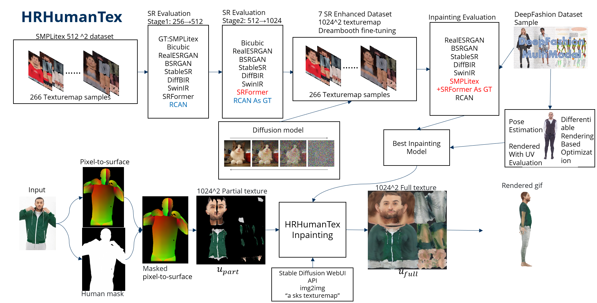

# HRHumanTex: High-Resolution Human Texture Estimation from a Single Image

[](LICENSE)
[](https://www.python.org/)
[](https://developer.nvidia.com/cuda-toolkit)

**MSc Thesis** · TU Dresden · Chair of Computer Graphics and Visualization · 2025

**Author:** Yunfan Liu — [spirit4471@gmail.com](mailto:spirit4471@gmail.com)
**Supervisors:** Dr. Kristijan Bartol, Prof. Dr. Stefan Gumhold

HRHumanTex generates **1024×1024** UV texture maps of clothed humans from a single RGB image by combining super-resolution (SR) data augmentation with DreamBooth-fine-tuned Stable Diffusion inpainting.

<p align="center">
  
</p>

---

## 🔬 Key Scientific Findings

1. **First systematic SR benchmark on UV texture data** — seven state-of-the-art SR models spanning CNN, GAN, Transformer, and Diffusion architectures are evaluated specifically for UV texture upscaling.

2. **UV-space vs. render-space quality mismatch** — diffusion-based SR models (DiffBIR, StableSR) achieve the *worst* pixel-space metrics (PSNR 20.75 dB) but the *best* rendering quality (SSIM 0.8162), revealing a fundamental disconnect between traditional image metrics and 3D visual quality.

3. **Data efficiency threshold** — approximately **100 training samples** are sufficient for coherent 1024² full-body texture inpainting, a ~500× reduction compared to TexDreamer's 50K+ requirement.

4. **Multi-level evaluation framework** — combines UV-space metrics (PSNR, SSIM, LPIPS, FID) with rendering-based evaluation (PyTorch3D + ROMP) and differentiable rendering texture optimization.

---

## 📦 Repository Structure

```
HRHumanTex/
├── hr_human_tex/                 # Core Python package
│   ├── partial_texture.py        #   DensePose + SGHM → partial UV texture
│   ├── inpaint.py                #   Diffusion-based texture inpainting
│   ├── stablediffusion_wrapper.py #  AUTOMATIC1111 WebUI API wrapper
│   ├── train_dreambooth.py       #   DreamBooth fine-tuning script
│   ├── text2image.py             #   Direct text-to-texture generation
│   └── evaluation/               #   Evaluation subpackage
│       ├── evaluate_sr.py        #     SR model benchmarking (PSNR/SSIM/LPIPS/FID)
│       ├── evaluate_texture_batch.py  # Rendering-based evaluation
│       ├── compare_results.py    #     Aggregate rendering metrics
│       └── optimize_uv_texture.py #    Differentiable rendering optimization
│
├── notebooks/                    # Jupyter notebooks
│   ├── HRHT.ipynb                #   Main training & inference workflow
│   ├── evaluation.ipynb          #   Full evaluation pipeline
│   ├── realesrgan_inference.ipynb #  Real-ESRGAN inference demo
│   ├── swinir_demo.ipynb         #   SwinIR super-resolution demo
│   └── pose_estimator.ipynb      #   ROMP pose estimation tests
│
├── scripts/                      # Utility scripts
│   ├── image_to_densepose.py     #   DensePose IUV extraction
│   └── render_back_front.py      #   Front/back texture rendering
│
├── sample-data/                  # SMPL UV template (needed for rendering)
├── thesis.pdf                    # Compiled MSc thesis (PDF)
├── requirements.txt              # Python dependencies
└── readme.txt                    # Original build instructions
```

---

## 🚀 Quick Start

### Prerequisites

- **OS:** Linux (Ubuntu 22.04 recommended)
- **GPU:** NVIDIA GPU with ≥24 GB VRAM (RTX 3090 / 4090)
- **CUDA:** 12.1+
- **Python:** 3.10

### Installation

```bash
# Clone the repository
git clone https://github.com/Spirit4471/HRHumanTex.git
cd HRHumanTex

# Create virtual environment
python3.10 -m venv venv
source venv/bin/activate

# Install dependencies
pip install -r requirements.txt
```

### Download Pretrained Models

Seven HRHumanTex inpainting variants (4 GB each) are available on Google Drive:

| Variant | SR Backbone | Architecture | Link |
|---------|------------|-------------|------|
| HRHumanTex-RCAN | RCAN | CNN + Channel Attention | [Download](https://drive.google.com/file/d/1XbQZ40yjD931UtpQlHCe6p2dfb-Zc_xc/view) |
| HRHumanTex-SwinIR | SwinIR | Swin Transformer | [Download](https://drive.google.com/file/d/1XbQZ40yjD931UtpQlHCe6p2dfb-Zc_xc/view) |
| HRHumanTex-SRFormer | SRFormer | Transformer + PSA | [Download](https://drive.google.com/file/d/1XbQZ40yjD931UtpQlHCe6p2dfb-Zc_xc/view) |
| HRHumanTex-DiffBIR | DiffBIR | Diffusion + IRControlNet | [Download](https://drive.google.com/file/d/1XbQZ40yjD931UtpQlHCe6p2dfb-Zc_xc/view) |
| HRHumanTex-StableSR | StableSR | Diffusion + Time-Aware Encoder | [Download](https://drive.google.com/file/d/1XbQZ40yjD931UtpQlHCe6p2dfb-Zc_xc/view) |
| HRHumanTex-RealESRGAN | Real-ESRGAN | GAN | [Download](https://drive.google.com/file/d/1XbQZ40yjD931UtpQlHCe6p2dfb-Zc_xc/view) |
| HRHumanTex-BSRGAN | BSRGAN | GAN | [Download](https://drive.google.com/file/d/1XbQZ40yjD931UtpQlHCe6p2dfb-Zc_xc/view) |

Place downloaded models in `./models/`.

### Inference Results

Pre-computed inpainting results on benchmark datasets:
- [SHHQ-1.0 results](https://drive.google.com/file/d/1A9wWjPvlQyAgFOmN7n-qPsDWcExaYSfm/view)
- [DeepFashion results](https://drive.google.com/file/d/1rm9FQPSePl68rWBCs9vVOWi7927LF4YS/view)

---

## 🧪 Pipeline Overview

### Stage 1 — Partial Texture Extraction

```
RGB Image → DensePose (pixel-to-UV mapping) + SGHM (human matting) → Partial UV Texture + Mask
```

### Stage 2 — Super-Resolution Data Augmentation

Seven SR models independently upscale 512² ground-truth textures to 1024², producing seven augmented training sets:

| Model | Architecture | 256→512 PSNR ↑ | 512→1024 PSNR ↑ |
|-------|-------------|----------------|-----------------|
| **RCAN** | CNN + Channel Attention | **36.75** | — |
| **SRFormer** | Transformer + PSA | 36.42 | **42.78** |
| SwinIR | Swin Transformer | 32.86 | 33.94 |
| BSRGAN | GAN | 32.67 | 33.40 |
| Real-ESRGAN | GAN | 31.78 | 32.24 |
| StableSR | Diffusion | 25.90 | 27.73 |
| DiffBIR | Diffusion | 20.75 | 24.53 |
| Bicubic | Interpolation | 32.62 | 34.13 |

### Stage 3 — Diffusion Inpainting

Each SR-augmented dataset trains a DreamBooth-fine-tuned Stable Diffusion v1.5 inpainting model (2000 steps, 8-step gradient accumulation, 8-bit AdamW).

### Stage 4 — Evaluation

- **UV-space:** PSNR, SSIM, LPIPS, FID against pseudo-ground-truth
- **Render-space:** SSIM, LPIPS on PyTorch3D-rendered SMPL meshes vs. original images
- **Differentiable rendering optimization:** Direct UV texture refinement via gradient descent

---

## 📊 Key Results

### The UV-Render Mismatch

The scatter plot below reveals that **better UV-space metrics ≠ better rendered appearance**. DiffBIR-based inpainting achieves the highest rendering SSIM despite scoring worst in UV-space, while SwinIR shows the opposite pattern.

This suggests that **rendering-based evaluation is essential** for assessing 3D texture synthesis quality — pixel-space metrics alone can be systematically misleading.

### Ablation: Training Data Scale

| Training Samples | Coherent Center | Limbs | Full Body | Rendering LPIPS ↓ |
|-----------------|:---:|:---:|:---:|:---:|
| 20 | ✅ | ❌ | ❌ | 0.384 |
| 50 | ✅ | ⚠️ | ❌ | 0.321 |
| 100 | ✅ | ✅ | ✅ | 0.291 |
| 266 | ✅ | ✅ | ✅ | **0.283** |

---

## ⚠️ Known Limitations

1. **Non-frontal faces** — profile or side views produce incomplete facial textures
2. **Garment boundary ambiguity** — long upper garments may "bleed" into lower body regions
3. **Single-view only** — occluded regions (back, sides) are hallucinated by the diffusion prior
4. **Hardcoded paths** — several scripts contain `/workspace/HRHumanTex/` absolute paths; use `config.yaml` or set `PROJECT_ROOT`
5. **AUTOMATIC1111 WebUI dependency** — `inpaint.py` requires a running Stable Diffusion WebUI instance (`./webui.sh --api`)

---

## 📝 Citation

```bibtex
@mastersthesis{liu2025hrhumantex,
  title   = {High-Resolution Human Texture Estimation from a Single Image},
  author  = {Yunfan Liu},
  school  = {Technische Universit\"at Dresden},
  year    = {2025},
  type    = {Master's Thesis},
  address = {Dresden, Germany},
  note    = {Chair of Computer Graphics and Visualization}
}
```

---

## 📄 License

This project is released under the [MIT License](LICENSE).  
The SMPL model files require separate registration at [smpl.is.tue.mpg.de](https://smpl.is.tue.mpg.de/).

---

## 🙏 Acknowledgements

This work was supervised by Dr. Kristijan Bartol and Prof. Dr. Stefan Gumhold at the Chair of Computer Graphics and Visualization, TU Dresden. GPU resources were provided by RunPod, Google Colab, and privately owned hardware. The thesis builds upon [SMPLitex](https://github.com/dancasas/smplitex) by Casas & Comino-Trinidad.
